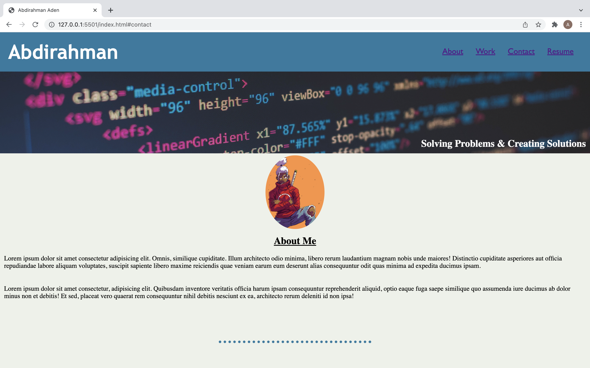
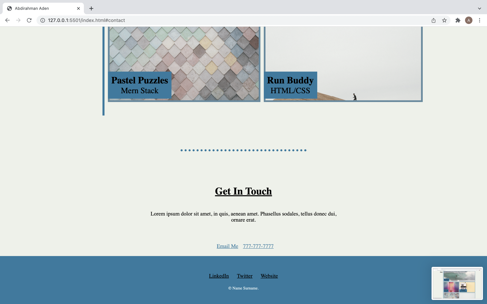

# ProjectPortfolioCSS

Project's Title: ProjectPortfolioCSS

Project Description: This project is the first project i was assigned with no code help. I was given a mockup of a portfolio website and used HTML and CSS to build a version of my own from scratch using the mockup. I used best practices on the markup using sematic tags and left descriptive comments on the stylesheet so that anyone could follow along!

Screenshots of website:

Links to website:
